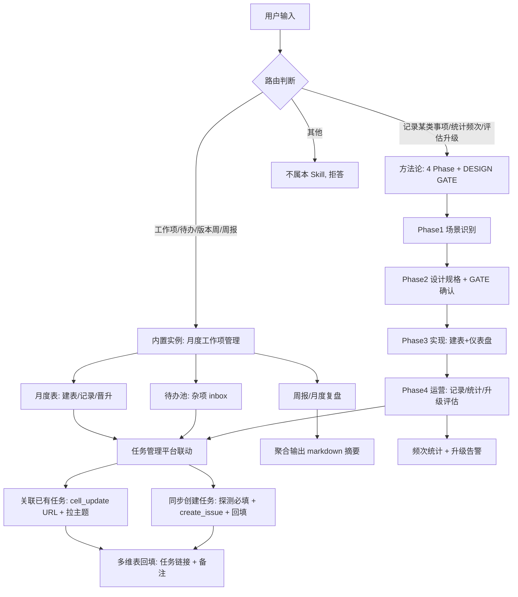

# 仿多维表格 Agent：用 企业 IM 多维表格 + Skill + Agent 运行平台 造个人项目管理助手

> 多维表格 Agent，IM 里 @机器人就能分析结构化数据并实现自动流。其实手边的 企业 IM CLI + 多维表格 + Skill + Agent 运行平台 组合起来，我们也能仿一个——定制贴合自己场景的工作流。
>
> 这背后是一种 AI 时代的提效范式：不在从零造轮子，而在识别手边的现成能力，用 Skill 编排组合，让 AI 替你管那些细碎的事。

## 引言：被细碎工作项淹没的日常

打工人每周的工作项来源很杂：口头派的活、IM 里突然冒出的需求、任务管理平台任务里挂着的 bug、运维群里用户反馈的临时干预……散落在各个角落。

更头疼的是汇报。工作项散落在 IM、会议纪要、任务、脑子各个角落，等到写周报、月报、季度总结时，突然发现自己根本想不起来这段时间到底干了什么——只能各处翻聊天记录、翻任务、拼凑汇总，费时费力还容易漏。

还有一类事更难管：线上用户临时反馈的运维操作（恢复团队空间、开放下载限制……）。每次都人工调非公开接口处理，处理完就忘。等到领导问"这个月人工运维了多少次，哪些该升级成后台超管能力"，只能凭印象。

今天受到协作平台的多维表格 Agent 启发，突然意识到：**我手边其实已经有所有需要的现成能力**—— 企业 IM CLI + 多维表格做数据底座、Skill 做能力编排、Agent 运行平台 做 Agent 入口，自己组合就能实现类似场景需求。

这篇文章，记录的就是从一个工作项管理 Skill，演进出个人项目管理 Agent 的全过程。整个设计到落地就花了半天不到。

---

## 第一部分：场景抓手——从月度工作项管理起手

### 痛点具象化

把上面那些痛点拆细，其实就三个：

1. **工作项散落**——IM/会议/任务/脑子，四五个地方
2. **汇报时搜集难**——周报月报季报，想不起干了啥，各处翻聊天记录拼凑
3. **任务与工作项脱节**——任务管理平台任务一个号，多维表记录另一处，复盘对不上

### 多维表格：低门槛的数据底座

企业 IM 多维表格是一个被低估的工具。它不只是表格——字段类型（文本/单选/日期/公式/超链接/附件/评分/复选框）、视图（表格/看板/甘特/表单）、仪表盘（柱状/饼图/折线）、公式字段（自动计算），这些组合起来，不用写一行代码就能搭出专业的管理工具。

本次实践里，多维表格承担**数据底座**的角色：所有工作项/待办/运维记录都落在多维表里，Skill 负责告诉 AI 怎么操作它，Agent 运行平台 负责让这些操作能在 IM 里被触发。


> 案例创建的多维表格文档全貌（月度工作项表+待办池+运维记录多个数据表）

### 第一个 Skill：固定模板的月度工作项表

第一版方案很直接——为月度工作项管理设计一张固定的多维表：

- **表结构**：按月建数据表（`2026年7月工作项`），10 个字段：工作项 / 版本周 / 状态 / 类型 / 开始日期 / 截止日期 / 完成度 / 任务链接 / 备注 / 工作时长(天)
- **版本周预填**：建表时按算法预生成全月所有版本周选项（如 7 月有 6 个：`0625~0701研发版本` 到 `0730~0805研发版本`），SingleSelect 选即可
- **跨月归位规则**：工作项按**开始日期所在月**归表，跨月版本周自然分散
- **甘特视图**：开始日期+截止日期自动绑定，时间线一目了然
- **任务联动**：`任务链接` 字段存任务管理平台任务 URL，一键跳转；建工作项后主动问"是否同步创建任务管理平台任务"

跑通基础闭环后，一句话就能操作：

> 我："加个工作项 多维表格历史记录服务发布启动 kafka 重平衡解耦"
> AI：已记录到 7 月表，版本周 0702~0708，进行中。是否同步创建任务管理平台任务？
> 我：是
> AI：任务已建 [内部链接已移除]


> 月度工作项表 + 甘特视图实拍

这一版解决了月度工作项管理，但要支持更多场景，固定模板不够用。

---

## 第二部分：通用化设计——从固定模板到方法论

### 从固定模板到通用方法论

第一版 Skill 用固定 10 字段模板跑通了月度工作项场景。但这套思路难以复制——比如后来要记录运维操作（统计频次、评估升级），字段需求完全不同：要场景分类、申请用户、处理结果、是否已升级。每个场景都硬编码一套字段，Skill 会越堆越臃肿，而且每个用户的字段需求还各不相同。

为了让 Skill 能服务更多场景、减少定制成本，需要把"固定字段模板"抽象成"设计方法论"——**模板是走完设计流程后的产物，不是设计的起点。Skill 不预设字段，而是教 AI 如何为任意场景设计 schema**。这样运维记录、客户咨询、手工修复等新场景都能走同一套方法论现场定制，Skill 本身零场景硬编码。

于是把 Skill 从"固定模板"重构为"方法论 + 能力 Kit + 内置实例"的双层结构。

### 双层架构

```
Skill
  ├─ 层1：内置实例（开箱即用，零设计）
  │   └─ 月度工作项管理（月度表+待办池）—— 第一版的固化成果
  │
  └─ 层2：方法论（新场景动态定制）
      └─ 运维记录 / 客户咨询 / 手工修复 / ... —— agent 现场设计
```

**层1** 是高频场景的固化：月度工作项管理（含待办池+晋升流程）作为内置实例，开箱即用，命中触发词直接走流程。

**层2** 是通用方法论：任何新场景，agent 走一套 4 Phase 流程现场设计 schema。

### 4 Phase + DESIGN GATE：模糊到清晰的引导

方法论的精髓在于**不替用户假设，用结构化问题引导**：

- **Phase 1 场景识别**——agent 问 7 个维度（时间/分类/统计/升级评估/关联/处理人/成本），用户答完出场景画像
- **Phase 2 Schema 设计 + DESIGN GATE**——agent 基于画像生成「设计规格」（字段清单/视图/仪表盘/升级阈值），**用户确认后才建表**
- **Phase 3 实现**——按规格建 datasheet + 字段 + 视图 + 仪表盘
- **Phase 4 持续运营**——记录/查询/统计/复盘/升级评估

DESIGN GATE 是关键——规格阶段改成本零，建表后改成本高。强制 gate 把返工消灭在确认前。

```
用户提新场景需求（如"记录运维操作统计频次"）
        ↓
┌─────────────────────────────────────┐
│ Phase 1: 场景识别（交互问答）          │
│  agent 问 7 维度：                    │
│  时间维度 / 分类维度 / 统计需求 /      │
│  升级评估 / 关联对象 / 处理人 / 成本    │
│  → 产出：场景画像                     │
└─────────────────────────────────────┘
        ↓
┌─────────────────────────────────────┐
│ Phase 2: Schema 设计 + DESIGN GATE   │
│  agent 生成「设计规格」artifact：      │
│  - 字段清单（name/type/必填）          │
│  - 视图清单（表格/看板/甘特）          │
│  - 仪表盘清单（柱状/饼图）             │
│  - 升级阈值（若有）                    │
│                                       │
│  ╔═══════════════════════════╗       │
│  ║  【DESIGN GATE】用户确认    ║       │
│  ║  是 → 进 Phase 3           ║       │
│  ║  调整 → 改规格重 review     ║       │
│  ╚═══════════════════════════╝       │
└─────────────────────────────────────┘
        ↓ （Gate 通过）
┌─────────────────────────────────────┐
│ Phase 3: 实现                         │
│  按规格建 datasheet + 字段 + 视图 +    │
│  仪表盘 + 登记 config 实例注册表        │
└─────────────────────────────────────┘
        ↓
┌─────────────────────────────────────┐
│ Phase 4: 持续运营                     │
│  记录 / 查询 / 统计 / 复盘 / 升级评估   │
└─────────────────────────────────────┘
```

### 能力 Kit：场景无关的 internal-cli 模式

Phase 3-4 的操作（建表/记录/查询/统计/导出）是通用的，不随场景变。Skill 把这些抽成「能力 Kit」，内置实例和新场景共用同一套 internal-cli 调用模式。新场景不用重写流程，只换 schema。

### 模式抽象：工作项型 vs 事件记录型

走完几个场景后，归纳出两类典型模式：

| 模式 | 时间维度 | 分类维度 | 统计 | 目的 |
|---|---|---|---|---|
| **工作项型** | 规划时间(开始+截止) | 状态/类型 | 无 | 个人时间管理 |
| **事件记录型** | 仅发生时间 | 自定义场景 | 频次+升级评估 | 成本评估+能力升级决策 |

工作项型对应月度工作项表；事件记录型对应运维记录——同场景多次执行就记多条，累计计数，超阈值提示产品化。

### 实例：运维记录场景走方法论落地

用方法论跑了一遍运维记录场景：

- Phase1 画像：事件记录型 / 分类=场景 / 需频次统计+升级评估 / 关联任务+接口
- Phase2 规格：10 字段（标题/场景/申请用户/关联任务/接口SOP/处理人/发生时间/处理结果/是否已升级/备注）+ 表格视图+看板视图 + 柱状图(各场景频次)+饼图(结果分布) + 升级阈值 3 次
- 用户确认后建表 + 仪表盘
- 之后每次运维执行记一条，仪表盘自动统计


> 运维记录表 + 频次统计仪表盘

这个场景我没在 Skill 里硬编码任何字段——agent 走方法论现场设计的。换个用户来跑客户咨询场景，agent 会设计完全不同的 schema。**Skill 本身零场景假设**。

---

## 第三部分：受多维表格 Agent 启发，向个人项目管理 Agent 演进

### 启发与差距

第一部分到第二部分，Skill 已经能管多种记录场景。但还有个遗憾：每次都要打开 AI 会话输入指令。

多维表格 Agent 给了启发——在 IM 里 @机器人 就能操作。差距在哪？

- Skill 是「文件型」——agent 会话内能用，但不会主动找人
- 缺 IM 入口——没法在 企业 IM/协作平台里 @机器人 触发
- 缺主动能力——不会在版本周切换时提醒我

正好手边有 Agent 运行平台——一个支持 IM 渠道、cron 定时、skill 加载的现成平台。组合 Agent 运行平台 + Skill，就能把"被动用的 Skill"激活成"主动找你的 Agent"。

### 演进路线：P1 / P2 / P3

#### P1 — IM Agent：Agent 运行平台 机器人接入

把 Skill 接入 Agent 运行平台 的 IM 渠道，实现自然语言操作：

- 配 Agent 运行平台 agent 路由：企业 IM/协作平台 @机器人 → 识别工作项意图 → 调用 Skill
- 测试：企业 IM 发"加个工作项 X" → 机器人回"已记录到 7 月表 0702~0708 版本周"
- 多轮对话上下文（Agent 运行平台 session 机制）：能追问"是否同步建任务"

这一步打通后，多维表格操作不再需要打开 AI 会话，IM 里一句话搞定。

#### P2 — 主动提醒：Agent 运行平台 cron

Agent 运行平台 的 cron 能力让 Skill 从"被动响应"变"主动提醒"：

- **版本周切换提醒**（每周四 09:00）：@用户"新版本周 X 开始，上周待办 N 项"
- **月度建表**（每月 1 日 00:01）：自动建新月度数据表，预填版本周选项
- **待办逾期**（每日 09:00）：待办池超 7 天未晋升 → 提醒
- **运维升级评估**（每周一）：场景累计 ≥ 阈值 → 提示"建议升级为后台超管能力"

cron 是 Agent 区别于工具的关键——它会主动找你，而不是等你想起它。

#### P3 — 多用户

当前 Skill 是单用户配置（一个多维表文档）。要成为团队级 Agent，还需：

- 每用户独立多维表文档（docId 按用户隔离）
- Agent 运行平台 机器人识别用户身份 → 路由到对应用户表

这一步是规模化的前提，让团队每个人都能有自己的个人项目管理 Agent。

### 组合公式

三层组合，就是完整的个人项目管理 Agent：

> **多维表格（数据底座）+ 项目管理 Skill（能力编排）+ Agent 运行平台（Agent 入口）= 个人项目管理 Agent**

- 多维表格：存什么、怎么算、怎么看
- Skill：AI 怎么操作多维表格（建表/记录/统计/升级评估）
- Agent 运行平台：在哪触发（IM）+ 何时主动（cron）+ 给谁用（多用户）

```
┌─────────────────┐  ┌─────────────────┐  ┌─────────────────┐
│   多维表格        │  │   Skill         │  │   Agent 运行平台      │
│  （数据底座）     │  │  （能力编排）    │  │  （Agent 入口） │
├─────────────────┤  ├─────────────────┤  ├─────────────────┤
│ • 字段类型        │  │ • 内置实例       │  │ • IM 渠道        │
│   (文本/日期/     │  │   (月度工作项)   │  │   (企业 IM/协作平台)    │
│    公式/...)     │  │ • 方法论         │  │ • cron 定时      │
│ • 视图           │  │   (4 Phase+GATE) │  │   (主动提醒)     │
│   (表格/看板/    │  │ • 能力 Kit       │  │ • skill 加载     │
│    甘特/表单)    │  │   (建表/记录/    │  │ • agent 路由     │
│ • 仪表盘         │  │    统计/复盘)    │  │ • session 上下文 │
│   (柱/饼/折线)   │  │ • 配置化         │  │                 │
├─────────────────┤  ├─────────────────┤  ├─────────────────┤
│ 存什么/怎么算/   │  │ AI 怎么操作      │  │ 在哪触发/何时    │
│ 怎么看           │  │ 多维表格         │  │ 主动/给谁用      │
└────────┬────────┘  └────────┬────────┘  └────────┬────────┘
         │                    │                    │
         └────────────────────┼────────────────────┘
                              ↓
                 ┌──────────────────────┐
                 │  个人项目管理 Agent   │
                 │  (自然语言即操作 +    │
                 │   主动提醒 + 状态感知)│
                 └──────────────────────┘
```

---

## 第四部分：成果总览与实战效果

### 支持的场景与工作流

Skill 落地后，支持以下场景与工作流：

**内置实例（开箱即用）——月度工作项管理**

| 工作流 | 触发 | 动作 |
|---|---|---|
| 建月度表 | 当月表不存在 | 按月建 datasheet + 预填全月版本周选项 + 3 视图(表格/看板/甘特) + Formula |
| 新增工作项 | "加个工作项 X" | 路由判断→写月度表(版本周+日期+状态) |
| 待办池录入 | "记个待办 Y" | 杂项 inbox，无版本周无日期 |
| 待办晋升 | "把待办 Y 排到本周" | 待办池→月度表(填版本周+日期) + 删待办池原记录 |
| 周报准备 | "准备周报" | 按版本周筛选 + 聚合 markdown |
| 关联任务 | "关联 业务系统 任务 12345" | cell_update 写 URL + 拉主题到备注 |
| 同步建任务 | 建工作项后提示 | 任务管理平台 create_issue + 回填 URL |

**方法论定制（新场景动态设计）**

| 场景类型 | 举例 | 核心能力 |
|---|---|---|
| 事件记录型 | 运维记录 / 客户咨询 / 手工修复 | 频次统计 + 升级评估仪表盘 |
| 工作项型（扩展） | 团队任务追踪 | 时间维度 + 甘特 |
| 任意新场景 | 走 4 Phase + DESIGN GATE | agent 现场设计 schema |

### 任务管理平台联动

两种联动方式，覆盖"已有任务"和"需建任务"两种场景：

**方式一：关联已有任务**
- 用户提供任务号/URL → 拼 `https://task.example.com/issues/<id>` → cell_update 写入「任务链接」字段（纯字符串）→ 调 任务管理平台 API 拉主题回填「备注」
- 一键跳转，任务与工作项双向可查

**方式二：同步创建任务**
- 建工作项后主动问"是否同步创建任务管理平台任务？"
- 用户同意 → 【GATE】探测项目必填字段（issue_fields_options）→ 一次性收集缺失必填值 → 透传 create_issue → 取 issue_id → 拼 URL 回填多维表
- 版本周标签自动匹配 任务管理平台 开发版本（如 `0702~0708研发版本` → `2026-0702~0708研发版本`）

### 成果流程图



### 对话样例

组合完成后，日常交互变成这样：

| 我说 | Agent 做 |
|---|---|
| "加个工作项 X 周五前完成" | 自动建/复用月度表 → 记录 → 问是否同步建任务管理平台任务 |
| "记个待办 Y" | 写入待办池（杂项 inbox） |
| "把待办 Y 排到下周二" | 晋升到月度表 + 删待办池原记录 |
| "看下哪些运维场景该升级" | 按场景 group-by count + 列出累计≥3次的清单 |
| （周四早 9 点 cron 触发） | @我"新版本周 0709~0715 开始，上周待办 2 项未晋升" |

从手动开多维表管记录，到 IM 里一句话让 Agent 代管——自然语言即操作。


> 企业 IM 机器人 Agent 运行平台 对话效果（@机器人自然语言操作多维表）

### meta-base-workitem-tracker Skill

这个 Skill（`meta-base-workitem-tracker`）已经落地：

- **5 个 reference 文件**：方法论 / 能力 Kit / 内置实例 / 任务管理平台建任务指引 / 配置
- **4 软链同步**：1 份原文 + ai-coding-tool/claude/codex/Agent 运行平台 软链，一致性免维护
- **双层结构**：内置月度工作项实例开箱即用 + 方法论为新场景动态定制

**直接用**：说"加个工作项""记个待办""把待办排到本周"——命中内置实例触发词即走流程。

**扩展用**：说"我想记录某类事项""统计 X 的频次评估升级"——走方法论 4 Phase + DESIGN GATE 现场定制 schema。

**交流**：Skill 持续演进，欢迎反馈场景、提缺陷、贡献实例。

### AI 时代提效倡议

这次实践最大的收获不是 Skill 本身，而是一种提效范式：

> **识别手边的现成能力 → 用 Skill 编排 → 用 Agent 运行平台 激活 = 自己的提效 Agent**

- 多维表格、任务管理平台、日志平台、任务管理平台、企业 IM……这些组织内的现成能力都是可组合的提效单元
- Skill 是编排层，教 AI 怎么组合这些现成能力
- Agent 运行平台 是激活层，让组合后的能力在 IM 里被触发、在 cron 里主动跑

不必等官方做出来你需要的 Agent。识别你的高频痛点，找手边的现成能力，写个 Skill 编排，接 Agent 运行平台 激活——你的个人提效 Agent 就成了。

AI 时代的提效，属于会组合现成能力的人。

---

## 附：演进时间线

1. **场景抓手**：月度工作项管理痛点 → 第一版固定模板 Skill
2. **通用化**：为支持多场景减少定制 → 双层架构（实例+方法论）+ DESIGN GATE
3. **韧性**：用户改字段会破坏 Skill → schema 漂移检测（ID 优先+名兜底）
4. **Agent 化**：受多维表格 Agent 启发 → Agent 运行平台 接入（P1 IM / P2 cron / P3 多用户）

每一步都是被真实痛点推着走，不是为演进而演进。这也是为什么最终能落地——每一步都解决了实际问题。
